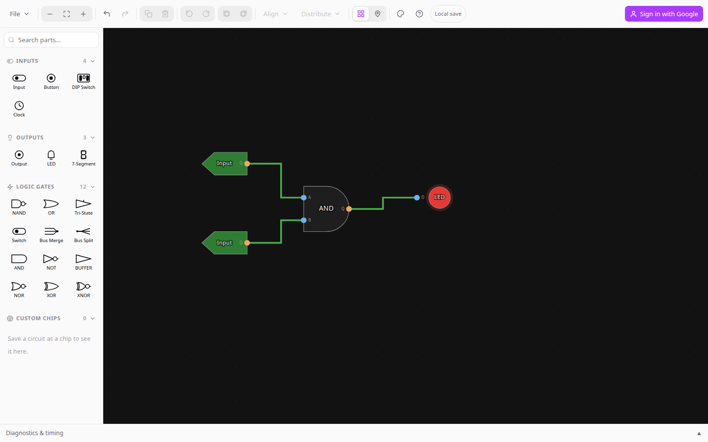
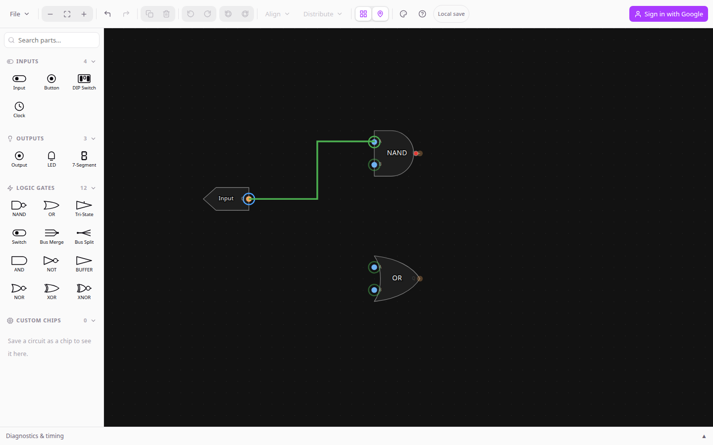
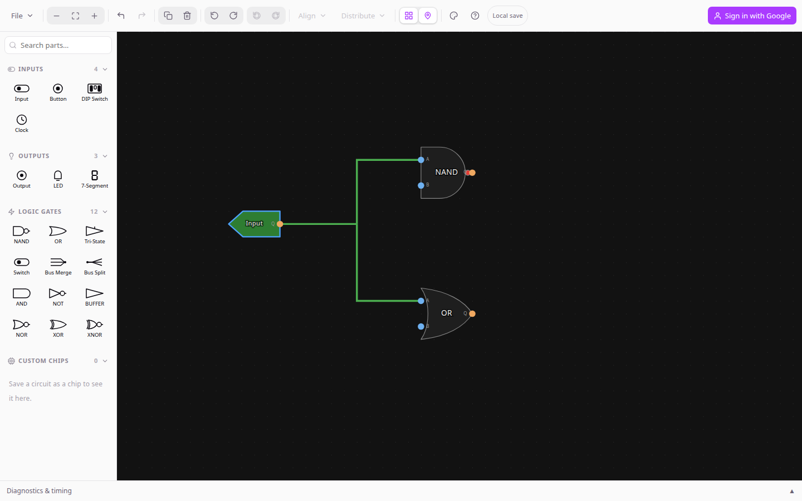
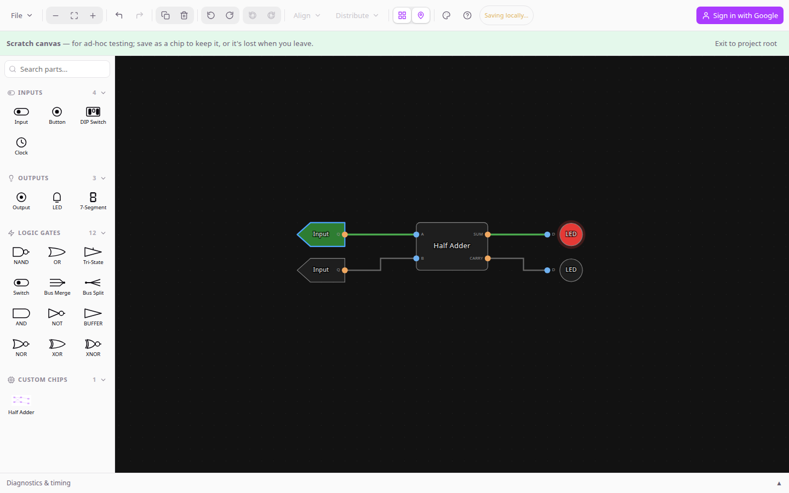
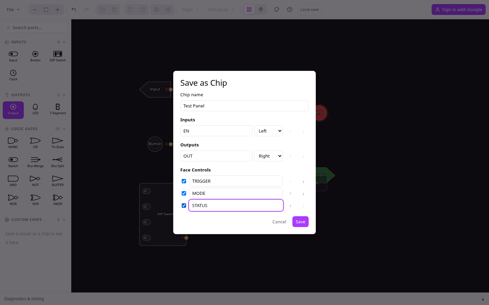
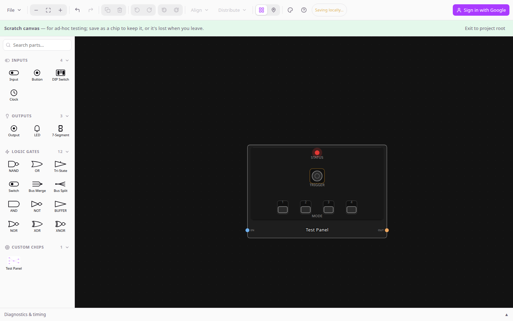
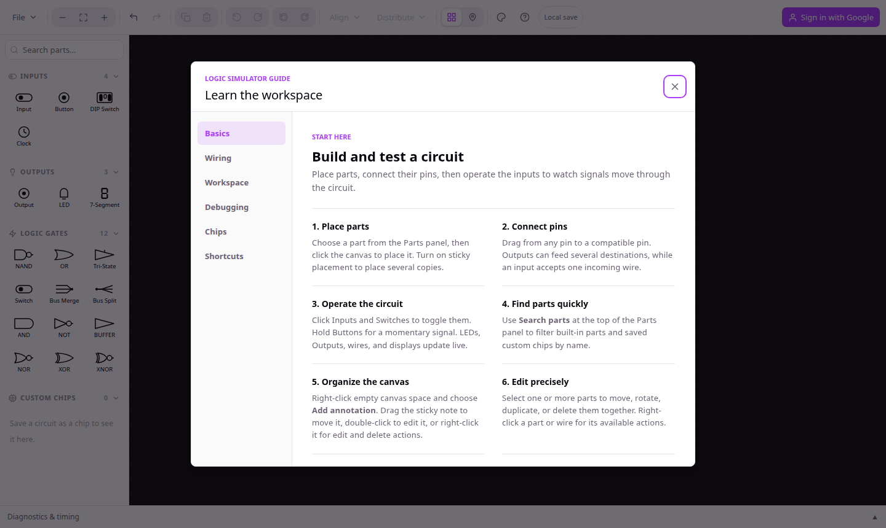
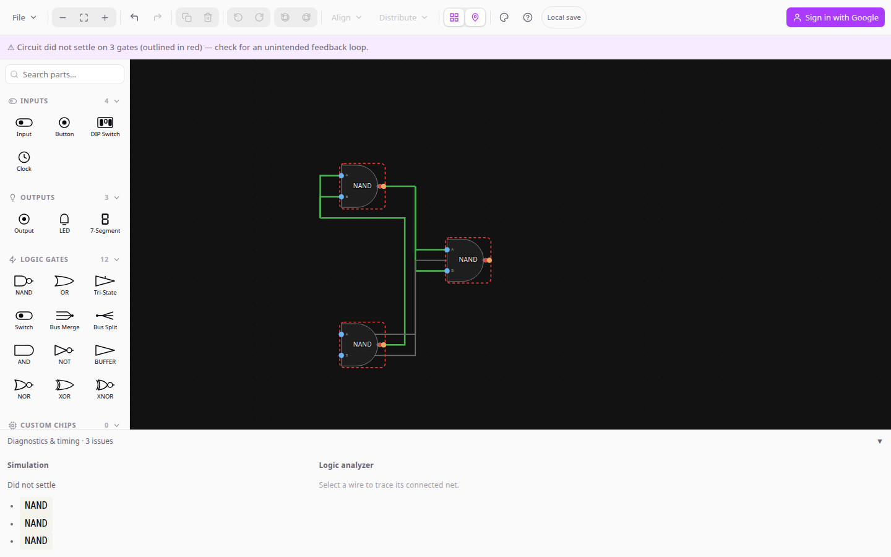

# Logic Simulator

**Build logic circuits from scratch, in your browser.**

Two primitive gates in. A computer out — eventually. Place NAND and OR gates, wire them
together, and watch signals flow live. Package any working circuit as a reusable chip and use it
inside the next one, exactly the way real ICs are built from smaller ICs.

### [**➜ Open Logic Simulator**](https://neldasi.github.io/LogicSim/)

No install, no account, no setup — it runs entirely in your browser.

## Why

Every chip on a real motherboard, all the way up to the CPU, is ultimately just NAND and OR gates
wired together in more and more elaborate patterns. Logic Simulator makes that visible and
buildable: start with a couple of primitive gates, wire up an AND or an XOR, save it as a chip, and
now that chip is a part you can drop into your *next* circuit — just like an OR gate. Nest that
enough times and you can work your way up to adders, registers, memory, and a working, simulated
computer.

## How it works

1. **Place a part.** Pick something from the Parts panel and click the canvas to drop it. Turn on
   sticky placement to place several copies in a row, or use *Search parts* to jump straight to
   the one you want.
2. **Wire it up.** Drag from a pin to a compatible pin to connect them. An output can feed several
   inputs at once; dragging a new wire onto an already-wired input just replaces the old
   connection.
3. **Run it.** Click Inputs and Buttons to drive the circuit and watch it respond in real time —
   wires light up green when they're carrying a high signal, and LEDs, Outputs, and displays
   update live as you interact.
4. **Turn it into a chip.** Once a circuit does something useful, use **File → Save as chip** to
   package it as a new reusable part with its own pins and, optionally, live controls (LEDs,
   Switches, Buttons) on its face. It shows up under *Custom* in the Parts panel, ready to be
   dropped into your next circuit — nested as deep as you like.

Everything you build autosaves to your browser as you go, so there's nothing to lose by
experimenting.

## Wiring circuits together

Drag from any pin toward another to draw a wire — start from an output or an input, whichever's
easier to reach. While you drag, every pin the loose end could legally land on lights up green so
you can see valid targets before you let go:

An output can drive as many inputs as you want — just drag a second wire off the same output pin.
An input, on the other hand, only ever takes one incoming wire; dragging a new connection onto an
already-wired input quietly swaps out the old one rather than erroring. Wires carry the live
simulation value as color: green for a high signal, a neutral gray/blue for low, so a fan-out reads
at a glance:

Wires route themselves automatically and re-route as you drag their connected parts around, but you
can take manual control too: click a wire to select it, then drag its body to pull out a bend
(shown here as the small square handle). Drag a handle again to move that bend, double-click it to
remove just that point, or right-click the wire and choose **Reset path** to drop every manual bend
and let it auto-route again:

To remove a wire entirely, double-click it (or select it and press Delete). And when a circuit has
more parallel wires than are comfortable to route by hand, a **Bus** part from the Logic Gates
palette bundles a run of individual wires into a single line you can resize (right-click it →
**Add bit**/**Remove bit**) — each lane still passes straight through to the matching pin on the
other side.

## Parts you can build with

| Category | Parts |
| --- | --- |
| **Primitives** | NAND, OR — every other gate on this list is built from these two |
| **Gates** | AND, NOT, BUFFER, NOR, XOR, XNOR — several of these support more than two inputs |
| **I/O & controls** | Input, Output, Button, DIP Switch, LED, 7-Segment display |
| **Timing** | Clock, with an adjustable rate and single-step debugging |
| **Buses & relays** | Switch (an in-line on/off pass-through, not a source), Tri-State, Bus, Bus Merge, Bus Split |
| **Custom** | Any circuit you've saved as a chip, ready to reuse and nest |

## A saved chip is a real, reusable part

Once you save a circuit as a chip, it isn't a special-cased "sub-circuit" — it drops into the next
canvas with its own edge pins, wired up exactly like a NAND or an AND gate would be. Below, a
**Half Adder** chip (internally just an XOR and an AND gate, built from `A`/`B` inputs and
`SUM`/`CARRY` outputs) sits between two Inputs and two LEDs. Toggling `A` on lights the `SUM` LED
live, the same way it would if the XOR and AND gates were sitting directly on the canvas:

Because nesting is unlimited, this is also how the project scales up in practice: a Half Adder
becomes a building block for a Full Adder, Full Adders chain into a byte-wide ALU, and so on —
each level hides its internals behind a handful of pins, just like the real 74LS-series chips this
project is modeled on.

## Chip faces: exposing internal controls

A real IC's package sometimes carries more than just pins — think of a DIP switch bank or a status
LED built into the part itself. Custom chips can do the same. When you save a circuit as a chip,
the Save dialog lists every LED, Button, DIP Switch, Switch, Clock, and 7-Segment display it can
find inside the circuit as a **face control** candidate. Tick the ones you want exposed, give each
a label, and reorder them with the ↑/↓ buttons — anything left unchecked stays internal, invisible
outside the chip (handy for debug scaffolding you don't want cluttering the finished part).

Once saved, every instance of that chip renders the exposed controls packed onto its own body,
grouped by kind and rotating rigidly with the chip — LEDs and other read-only indicators light up
live, while Buttons, DIP Switches, and Switches are clickable right there on the chip's face, no
need to open it up. Boundary pins (here `EN` and `OUT`) still sit on the chip's edges as usual;
face controls are an addition, not a replacement.

Exposed controls compose across nesting, too: if a chip you're building includes an instance of
*another* custom chip that already exposes its own face controls, those show up as candidates in
your Save dialog as well — so an indicator can bubble all the way up from a deeply nested primitive
to the outermost chip, the same way output pins already do.

## Built-in guide

Press **?** anywhere inside the app to open a full in-app guide — wiring, chip-building, debugging
tools, and every keyboard, mouse, and touch shortcut, without leaving the canvas.

## Debugging a circuit

Anything driven by a Clock can be paused, resumed, or single-stepped one edge at a time. You can
also set a breakpoint on a specific clock edge or on a wire's signal changing, which pauses the
whole simulation the moment it happens — handy for catching exactly when a sequential circuit
does the wrong thing. If a circuit can't settle (usually a feedback loop or two drivers fighting
over the same signal), the offending parts get a red dashed outline and the diagnostics drawer
helps track down why.

Below, three NAND gates wired output-to-input in a ring (each one acting as an inverter) can never
settle on a value — a warning banner names the count, the gates themselves get outlined in red, and
the diagnostics drawer's Simulation panel lists exactly which gates are still changing every
iteration:

The same drawer's Logic analyzer panel can trace any wire you select over time as a live waveform —
useful for watching a Clock-driven signal or a flip-flop's output settle (or fail to).

## Your work, saved and shared

Circuits and your custom chip library save automatically to your browser's local storage — no
account needed. When you do want to move work around, export a circuit or your whole chip library
to a JSON file and import it again later, on another machine, or send it to someone else. Sign in
with Google for optional cloud sync, with multiple named save slots and autosave.

---

**[neldasi.github.io/LogicSim](https://neldasi.github.io/LogicSim/)**

